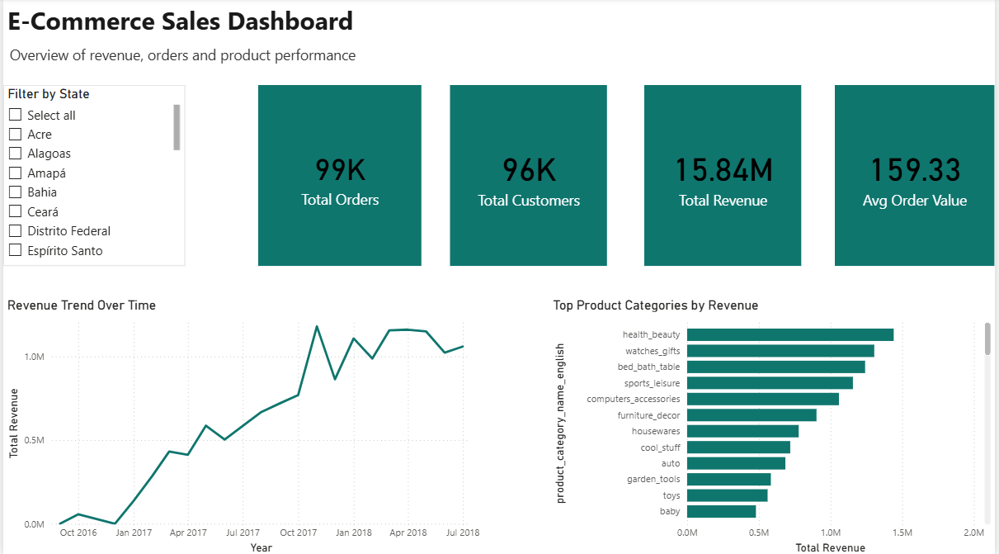

# 📊 End-to-End E-Commerce Sales Analytics & Customer Segmentation

An end-to-end data analytics project built on the **Olist Brazilian E-Commerce Public Dataset (100K+ transactions)** that transforms raw transactional data into actionable business insights using **Python** and presents them through an interactive **Power BI dashboard**.

The project covers the complete analytics workflow, including data cleaning, multi-table dataset integration, exploratory data analysis (EDA), KPI analysis, RFM (Recency, Frequency, Monetary) customer segmentation, Pareto (80/20) analysis, and business intelligence reporting.

---

# 📌 Project Overview

This project analyzes a real-world Brazilian e-commerce dataset to evaluate sales performance, customer value, delivery efficiency, and product category performance.

Using Python, the raw data was cleaned, transformed, and analyzed to generate meaningful business KPIs and customer segments. The processed analytical dataset was then used to build an interactive Power BI dashboard for business performance monitoring and decision-making.

---

# 🎯 Business Objectives

- Analyze total revenue and monthly sales trends
- Evaluate delivery performance and shipping delays
- Identify top-performing product categories
- Perform RFM-based customer segmentation
- Apply Pareto (80/20) analysis to understand revenue concentration
- Develop an interactive dashboard for business KPI monitoring

---

# 📂 Dataset

**Olist Brazilian E-Commerce Public Dataset**

The project utilizes multiple relational datasets, including:

- Customers
- Orders
- Order Items
- Payments
- Products
- Sellers
- Reviews
- Geolocation
- Product Category Translation

**Dataset Size:** **100K+ E-commerce Transactions**

---

# 🔄 Project Workflow

```text
Raw Olist Dataset
        │
        ▼
Data Cleaning & Preprocessing
        │
        ▼
Multi-table Dataset Integration
        │
        ▼
Feature Engineering
        │
        ▼
Exploratory Data Analysis (EDA)
        │
        ▼
Business KPI Analysis
        │
        ▼
RFM Customer Segmentation
        │
        ▼
Pareto (80/20) Analysis
        │
        ▼
Processed Analytical Dataset
        │
        ▼
Interactive Power BI Dashboard
```

---

# 🔍 Analysis Performed

### Data Preparation

- Data Cleaning & Preprocessing
- Missing Value Analysis
- Multi-table Dataset Integration
- Feature Engineering

### Exploratory Data Analysis

- Monthly Revenue Trend Analysis
- Delivery Time & Delay Analysis
- Product Category-wise Revenue Analysis
- Business KPI Evaluation

### Customer Analytics

- RFM (Recency, Frequency, Monetary) Score Calculation
- Customer Segmentation
- Pareto (80/20) Revenue Concentration Analysis

---

# 📈 Key Insights

- 💰 **Total Revenue:** **15.4M+ BRL**
- 📦 **Total Delivered Orders:** **96,478**
- 🛒 **Average Order Value (AOV):** **159.83 BRL**
- 🚚 **Average Delivery Time:** **~12 Days**
- 📊 Approximately **49% of total revenue** was generated by a relatively small group of customers, demonstrating the Pareto principle.
- 🏆 Top-performing product categories:
  - Health & Beauty
  - Watches & Gifts
  - Bed, Bath & Table

---

# 👥 Customer Segmentation (RFM)

Customers were segmented using **Recency, Frequency, and Monetary (RFM)** analysis into:

- Champions
- Loyal Customers
- Potential Loyalists
- At Risk
- Others

This segmentation helps identify high-value customers and supports targeted marketing and customer retention strategies.

---

# 📊 Interactive Power BI Dashboard

The processed dataset generated from the Python analysis was used to develop an interactive Power BI dashboard for business performance monitoring.

### Dashboard Features

- KPI Cards
  - Total Revenue
  - Total Orders
  - Total Customers
  - Average Order Value (AOV)
- Monthly Revenue Trend Analysis
- Top Product Categories by Revenue
- State-Level Filtering for regional insights

---
# 📸 Dashboard Preview

### Complete Dashboard



---

# 💡 Business Insights

- Revenue trends provide visibility into overall business performance over time.
- A relatively small customer segment contributes nearly half of the total revenue, demonstrating the Pareto principle.
- RFM segmentation identifies high-value customers for targeted marketing and retention strategies.
- Health & Beauty, Watches & Gifts, and Bed, Bath & Table are the leading revenue-generating product categories.
- Interactive KPI monitoring enables quick analysis of revenue, orders, customers, and regional performance.

---

# 🛠️ Tools & Technologies

### Programming

- Python

### Libraries

- Pandas
- Matplotlib

### Business Intelligence

- Power BI

### Development Environment

- Jupyter Notebook

### Version Control

- Git
- GitHub

---

# 🧠 Skills Demonstrated

- Data Cleaning & Preprocessing
- Feature Engineering
- Multi-table Dataset Integration
- Exploratory Data Analysis (EDA)
- KPI Calculation & Analysis
- Time-Series Revenue Analysis
- Customer Segmentation (RFM)
- Pareto (80/20) Analysis
- Interactive Dashboard Development (Power BI)
- Business Insight Extraction
- Data Storytelling

---

# 📁 Repository Structure

```text
ecommerce-sales-analytics/
│
├── notebooks/
│   └── E-commerce_Analysis.ipynb
│
├── images/
│   └── dashboard.png
│
└── README.md
```

---

# 🚀 Impact

- Transformed raw transactional data into meaningful business KPIs.
- Integrated multiple relational datasets into a unified analytical workflow.
- Identified high-value customer segments using RFM analysis.
- Applied Pareto analysis to understand revenue concentration.
- Built an interactive Power BI dashboard for business performance monitoring.
- Delivered actionable insights to support data-driven decision-making.

---

⭐ **If you found this project useful, consider giving it a star!**
